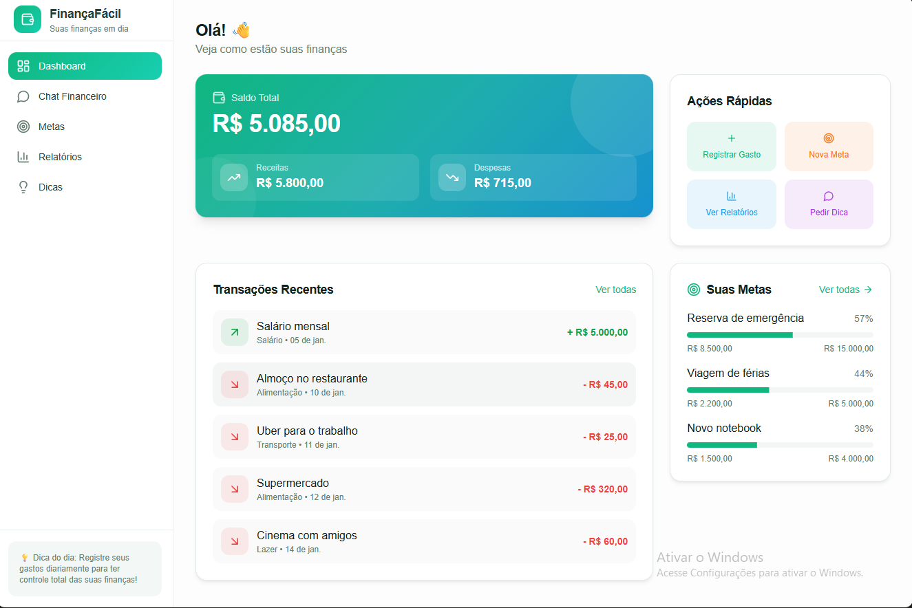
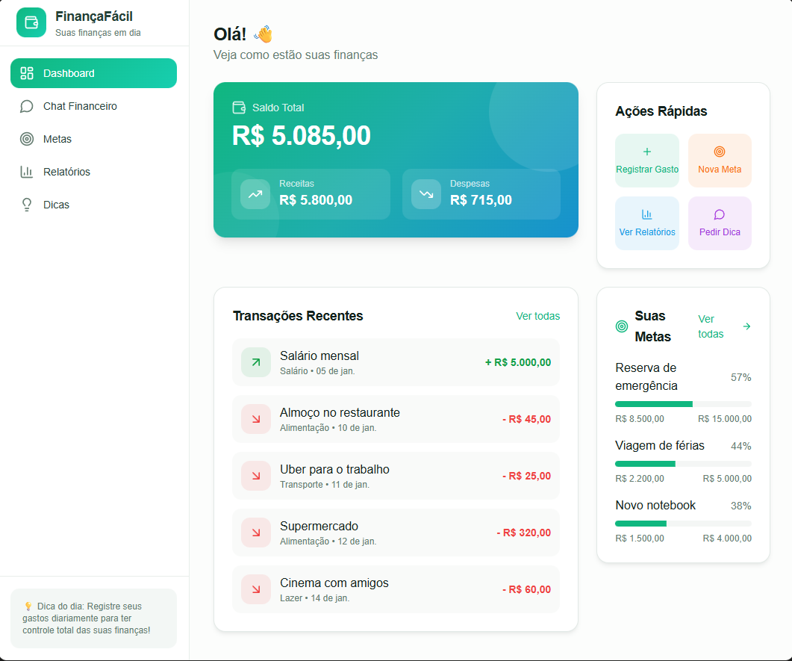
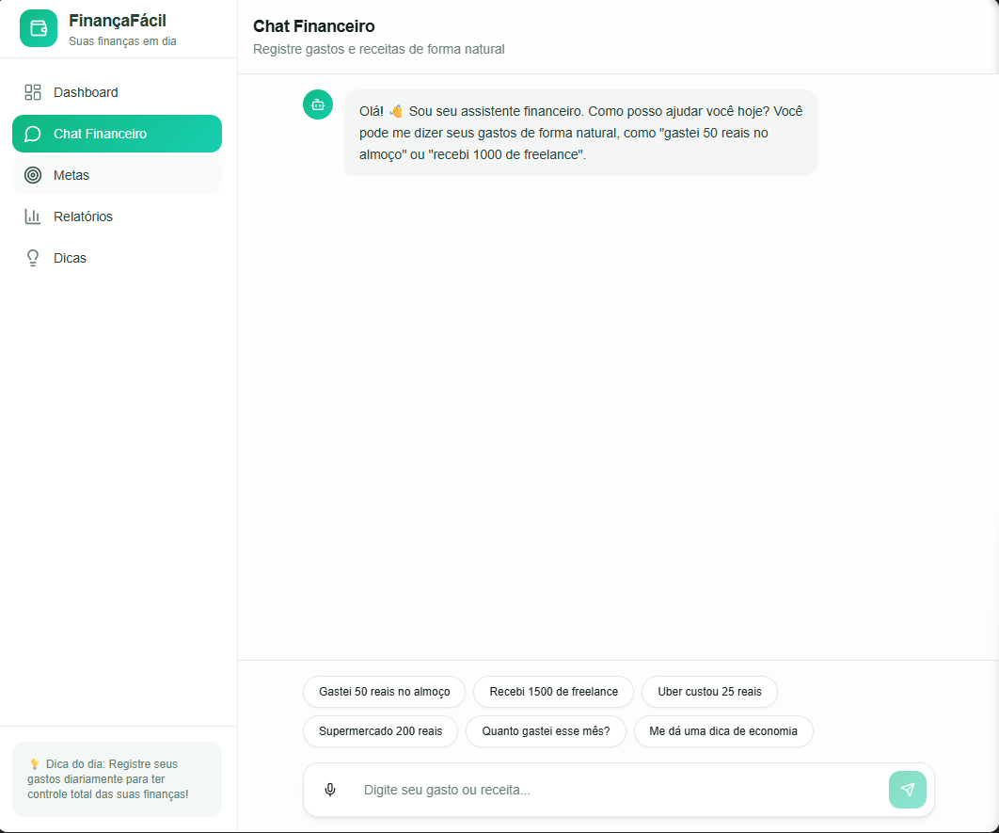
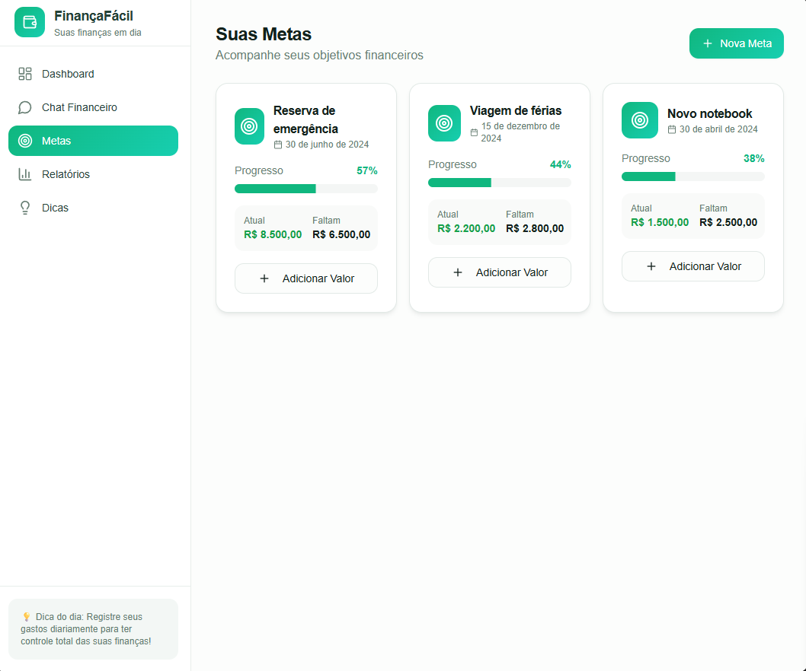
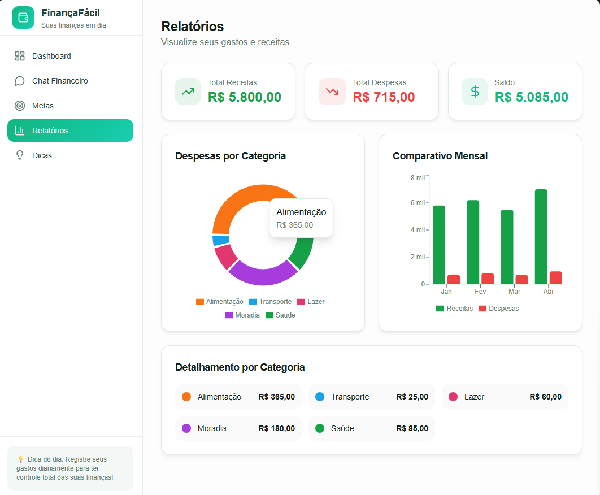
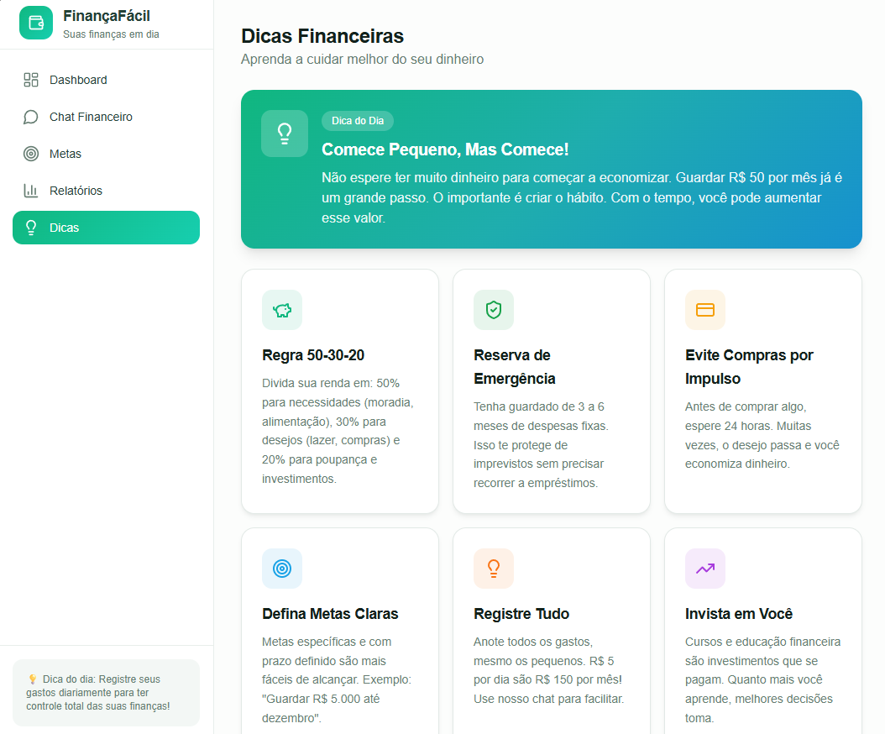
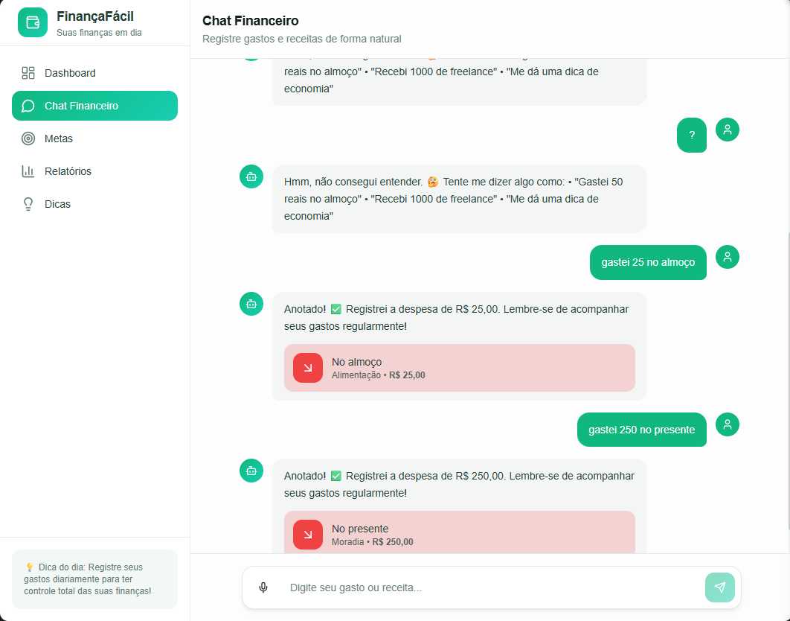
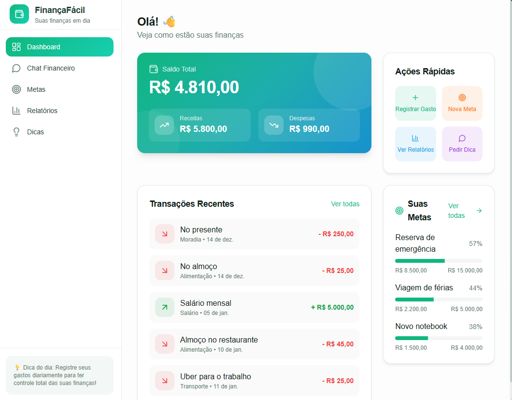

# 💸 App de Organização de Finanças Pessoais com Vibe Coding

Este projeto apresenta o **conceito de um aplicativo de organização de finanças pessoais** desenvolvido a partir da abordagem de **Vibe Coding**, utilizando IA como parceira criativa (Copilot, Lovable, etc.).

O foco **não é a implementação de código**, mas sim a **construção do conceito**, do **MVP** e da forma correta de **conversar com a IA** para transformar ideias em soluções digitais viáveis.

---

## ✨ O que é Vibe Coding

**Vibe Coding** é uma abordagem leve e criativa para desenvolver soluções com IA, baseada em **conversas naturais, bem contextualizadas e intencionais**.

Em vez de escrever código linha por linha, você aprende a:

* Explicar o problema com clareza
* Definir o contexto corretamente
* Guiar a IA com prompts bem estruturados

> Você define a vibe da ideia, e a IA ajuda a transformar isso em um produto conceitual funcional.

---

## 🎯 Objetivo do Projeto (MVP)

Criar um **Produto Mínimo Viável (MVP)** de um app que permita ao usuário:

* Registrar gastos por meio de **conversa em linguagem natural**
* Receber **classificação automática** das despesas
* Definir e acompanhar **metas financeiras simples**
* Visualizar **relatórios básicos e acessíveis**
* Receber **dicas personalizadas** de economia por meio de um *Agente Financeiro*

Tudo isso com foco em **simplicidade**, **educação financeira** e **baixa fricção de uso**.

---

## 🧠 Problema que o App Resolve

Muitas pessoas deixam de controlar suas finanças porque:

* Os aplicativos exigem muita entrada manual de dados
* A criação de orçamentos é cansativa e pouco intuitiva
* Falta personalização e orientação prática

Este projeto propõe uma solução baseada em **conversa**, onde o usuário interage como se estivesse falando com um assistente financeiro pessoal.

---

## 📱 Principais Telas do MVP

**[Finanças](https://taylor0001.lovable.app/)**

  
  
  
  
  
  
  
  

### 1. Tela de Boas-Vindas / Onboarding

* Explicação simples sobre o funcionamento do app
* Exemplo de uso em linguagem natural:

  * *“Gastei R$50 no mercado”*
* Introdução ao conceito de conversa como principal interface

### 2. Tela de Conversa (Chat Financeiro)

* Campo de entrada por **texto** (com visão futura para **voz**)
* Respostas imediatas do **Agente Financeiro**
* Sugestões automáticas de categorização:

  * *“Quer que eu categorize esse gasto como alimentação?”*

### 3. Tela de Metas

* Definição de metas simples:

  * *“Economizar R$200 este mês”*
* Barra de progresso visual e intuitiva

### 4. Tela de Relatórios

* Gráficos simples (pizza ou barras)
* Resumos em linguagem acessível:

  * *“Você gastou 30% em alimentação neste período”*

### 5. Tela de Dicas

* Recomendações automáticas do **Agente Financeiro**
* Exemplos práticos:

  * *“Reduzindo 10% dos pedidos de delivery, você pode economizar R$80/mês”*

---

## ⚙️ Recursos Conceituais Necessários

* **Processamento de Linguagem Natural (NLP)** para interpretar frases como *“gastei R$50 no mercado”*
* **Motor de Classificação Automática** de despesas (alimentação, transporte, lazer, etc.)
* **Banco de Dados Simples** para gastos, metas e relatórios
* **Interface Conversacional** como principal meio de interação
* **Módulo de Relatórios** com gráficos e resumos básicos
* **Agente Financeiro** responsável por feedbacks e recomendações

---

## ✅ Esboço de Validação Inicial

### 1. Teste com Usuários Iniciantes

* Convidar entre **10 e 20 pessoas** que nunca usaram apps financeiros
* Observar se conseguem registrar gastos sem instruções complexas

### 2. Métricas de Sucesso

* Percentual de usuários que registram **ao menos 5 gastos** na primeira semana
* Percentual de usuários que definem **pelo menos uma meta financeira**
* Feedback qualitativo:

  * *“Foi fácil registrar meus gastos?”*
  * *“As dicas foram úteis?”*

### 3. Iteração Rápida

* Ajustar categorias conforme erros mais comuns
* Simplificar relatórios se houver confusão
* Refinar o tom do **Agente Financeiro** para ser mais humano e acessível

---

## 🪄 Processo com IA (Vibe Coding na Prática)

O desenvolvimento deste conceito seguiu estes passos:

1. Criação de um **PRD simplificado (prompt)** explicando contexto, problema e público-alvo
2. Revisão e otimização do prompt com auxílio do Copilot
3. Exploração do Lovable para gerar:

   * Fluxo conceitual de telas
   * Comportamento do Agente Financeiro
   * Plano resumido de MVP

---

## 📌 Resumo Educativo

Este MVP foi pensado para ser **leve, conversacional e educativo**, ajudando iniciantes a dar os primeiros passos no controle financeiro.

O objetivo **não é competir com apps financeiros completos**, mas sim **reduzir barreiras**, tornar o processo mais humano e demonstrar como o **Vibe Coding** pode transformar ideias em produtos conceituais reais — mesmo sem escrever código.

---

## 💬 Conclusão

Vibe Coding é sobre **clareza, intenção e criatividade**. Ao aprender a conversar melhor com a IA, você amplia sua capacidade de criar soluções digitais.

Este projeto demonstra que, com bons prompts e visão clara, é possível transformar uma ideia simples em um conceito de produto sólido e bem estruturado.

## 👤 Autor

Feito por **Taylor Corrêa**  

🔗 LinkedIn: https://www.linkedin.com/in/taylor-corrêa

🔗 Github: https://github.com/digitalinnovationone/dio-lab-vibe-coding-app-financas
