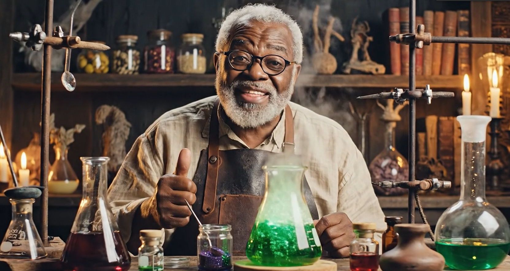
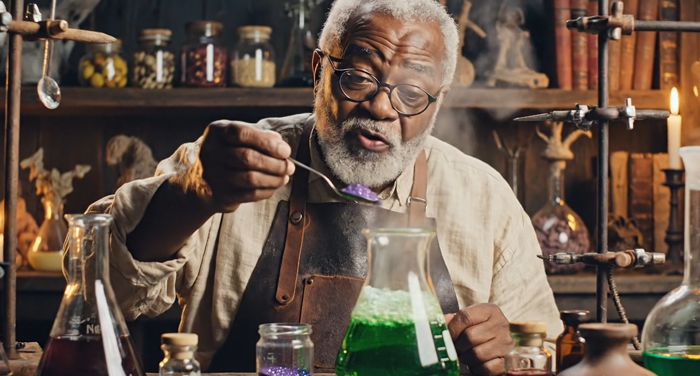
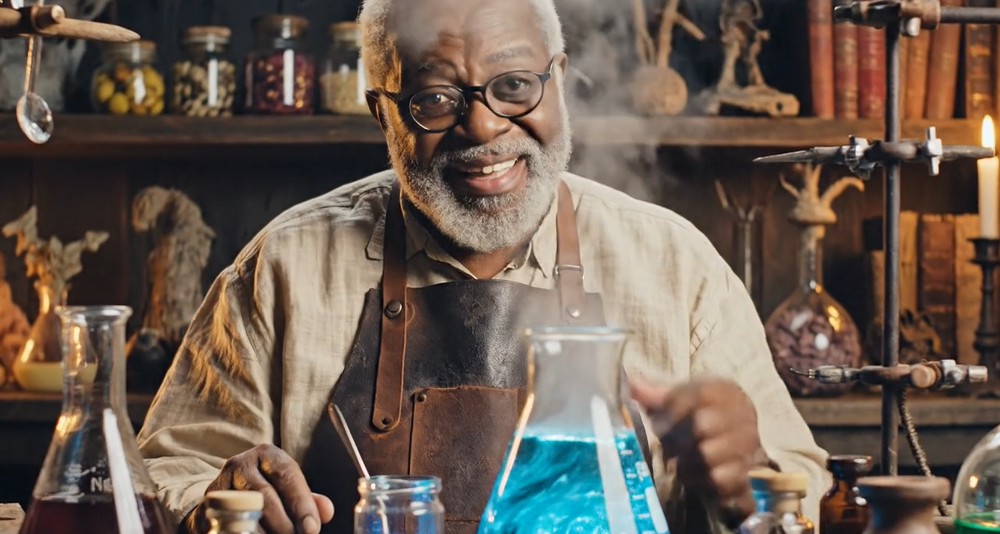

# 🤖 A Jornada da IA: Um Passeio pelo Futuro

## 📘 Sobre o Projeto

E-book de 5 páginas que aborda o impacto das IAs Generativas no dia a dia e sua influência no futuro da educação, criatividade e tecnologia.

## 🧠 Tecnologias Utilizadas

- Whisk IA – estruturação do conteúdo, revisão e roteirização
**[Whisk IA](https://labs.google/fx/pt/tools/whisk)**

- Geminigen IA – criação das artes visuais e vídeos do e-book
**[Geminigen IA](https://geminigen.ai/?hard=true)**

## ⚙️ Processo

O conteúdo foi desenvolvido com apoio do **Whisk IA**, organizando ideias e transformando a pesquisa em um material coeso.
Os elementos visuais e vídeos foram gerados com o **Geminigen IA**.
Todo o projeto foi produzido utilizando IAs Generativas do início ao fim.

## 🎯 Resultado

Material didático, envolvente e visualmente rico, demonstrando o uso prático de IA na criação de conteúdo educacional.

  
  
  

  

## 🔗 Links úteis

**[Geminigen IA](https://geminigen.ai/?hard=true)**
**[Whisk IA](https://labs.google/fx/pt/tools/whisk)**
**[Grok](https://grok.com/)**
**[Pollo IA](https://pollo.ai/pt/home)**
**[Hailuoai Vídeo](https://hailuoai.video/)**
**[Deevid IA](https://deevid.ai/pt/)**
**[Leonardo IA](https://leonardo.ai/)**
**[Flow](https://labs.google/fx/pt/tools/flow)**

## 💡 Aprendizados

Este projeto reforçou o potencial das IAs como ferramentas criativas e educacionais, ampliando possibilidades na produção e disseminação do conhecimento.

## 🧩 O Desafio do “Natty” com IA

Um dos principais desafios deste projeto foi criar algo verdadeiramente “natty” — natural, autêntico e com identidade própria — utilizando IA.
O risco de resultados genéricos é alto quando se depende apenas de geração automática. Por isso, o foco esteve em direcionar bem os prompts, revisar criticamente cada saída e tomar decisões humanas ao longo do processo.
A IA foi tratada como uma ferramenta criativa, não como um substituto, garantindo que o resultado final mantivesse coerência, intenção e personalidade.

## 👤 Autor

Feito por **Taylor Corrêa**  

🔗 LinkedIn: https://www.linkedin.com/in/taylor-corrêa

🔗 Github: https://github.com/digitalinnovationone/lab-aws-sagemaker-canvas-estoque
