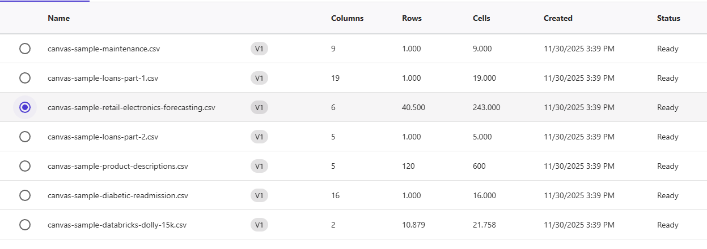
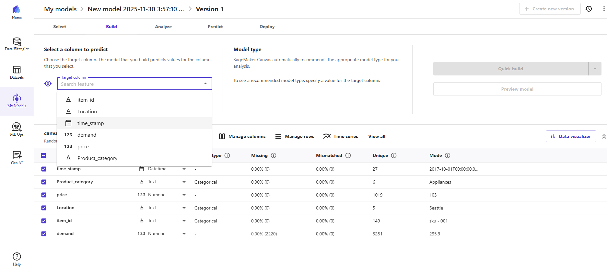
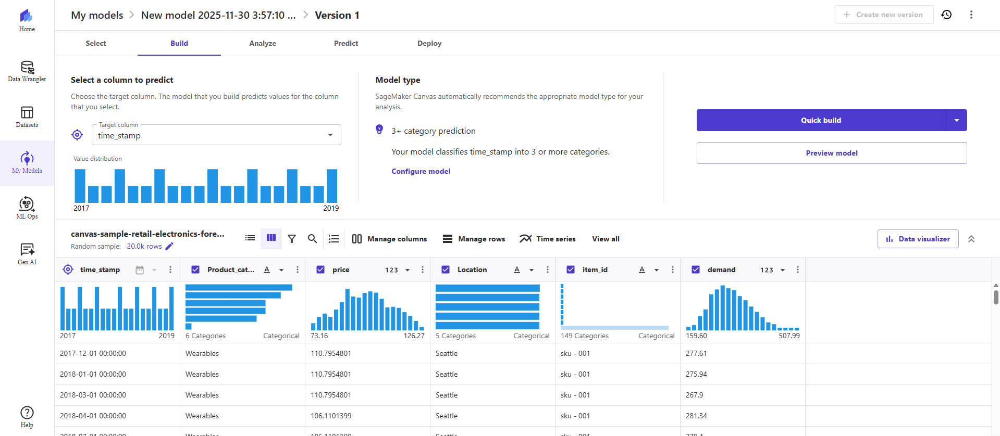
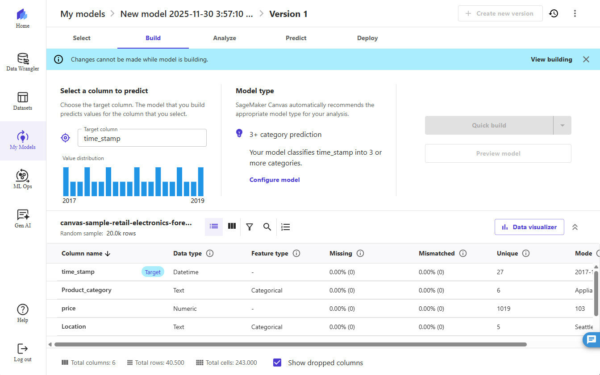
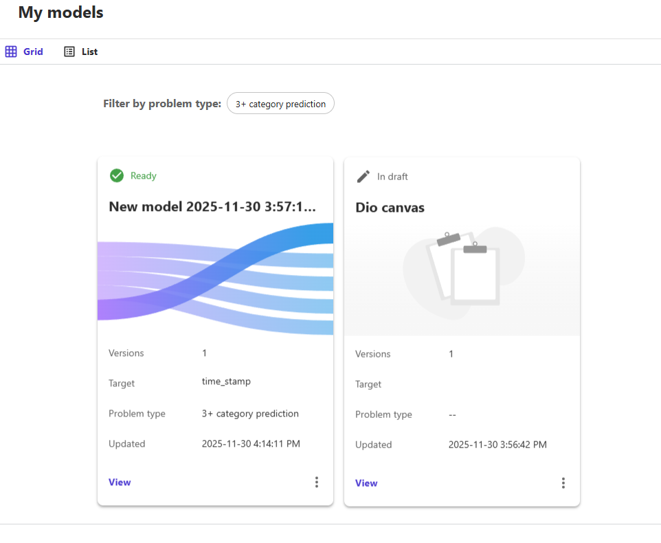

# 📊 Previsão de Estoque Inteligente com AWS SageMaker Canvas

Este repositório faz parte do desafio de projeto da DIO, onde aplicamos Machine Learning **no-code** utilizando o **Amazon SageMaker Canvas** para criar um modelo capaz de prever níveis de estoque de forma inteligente.

O objetivo é demonstrar o processo completo: desde a seleção do dataset até o treinamento, análise e geração de previsões.

---

## 📦 Objetivo do Projeto

Neste projeto você irá:

- Criar um modelo de **Previsão de Estoque** usando o SageMaker Canvas;
- Explorar dados e entender padrões de consumo;
- Treinar e avaliar um modelo preditivo;
- Gerar previsões reais utilizando dados carregados no ambiente AWS;
- Documentar todo o processo aqui no README.

---

## 🚀 Passo a Passo do Desenvolvimento

### 1️⃣ Selecionar o Dataset

1. Acesse a pasta `datasets/` deste repositório.  
2. Escolha a base de dados desejada (ou crie uma própria).  
3. Acesse o **Amazon SageMaker Canvas**.  
4. Faça upload do arquivo CSV para iniciar sua análise.

---

### 2️⃣ Construir e Treinar o Modelo

Após carregar o dataset no Canvas:

1. Analise automaticamente os dados carregados.  
2. Defina qual coluna será a **variável de saída** (target) — ex.: `estoque`, `quantidade_prevista`, etc.  
3. Verifique se o tipo de previsão é **regressão** ou **classificação**.  
4. Treine o modelo usando **Quick Build** ou **Standard Build**.

O treinamento pode levar alguns minutos dependendo do dataset.

---

### 3️⃣ Analisar os Resultados

Depois do treinamento:

- Avalie a **acurácia**, **RMSE**, **F1-score** ou a métrica otimizada pelo Canvas.  
- Verifique o gráfico de **importância das variáveis**, que mostra quais colunas mais influenciam no resultado.  
- Reavalie e refine seu dataset se necessário.  
- Se necessário, ajuste colunas, limpe dados ou faça um novo treinamento.

---

### 4️⃣ Gerar Previsões

Com o modelo treinado:

1. Use a aba **Predict** para fazer previsões.  
2. Envie um novo arquivo CSV ou use linhas individuais.  
3. Exporte o resultado em CSV ou Excel.  
4. Utilize os dados para insights reais sobre controle e previsão de estoque.

---

## 🧠 Insights Obtidos

Após as previsões, é possível responder:

- Quais variáveis mais influenciam o estoque?
- Qual a precisão do modelo?
- Em quais casos o modelo apresenta maior erro?
- Qual a tendência de estoque para os próximos dias/semanas?

*(Substitua estas perguntas pelos seus insights pessoais.)*

---

## 📈 Exemplo de Resultado (opcional)

Coloque aqui prints ou gráficos gerados pelo SageMaker:

Exemplo:

Accuracy: 80.63%

Feature mais importante: Time_stamp

Previsões exportadas para CSV com sucesso

  
  
  
  
  

---

## 🛠 Tecnologias Utilizadas

- **AWS SageMaker Canvas** (No-Code ML)
- **Machine Learning AutoML**
- **Amazon S3** (armazenamento de datasets)
- **Git/GitHub**

## 👤 Autor

Feito por **Taylor Corrêa**  
🔗 LinkedIn: https://www.linkedin.com/in/taylor-corrêa/

---

## 🏁 Conclusão

Este projeto demonstra a facilidade e o poder do **Machine Learning No-Code** usando o **SageMaker Canvas**, possibilitando criar modelos reais de previsão de estoque sem escrever uma única linha de código.

Sinta-se à vontade para evoluir o modelo, criar visuais, automatizar previsões ou integrar com outras ferramentas AWS!

